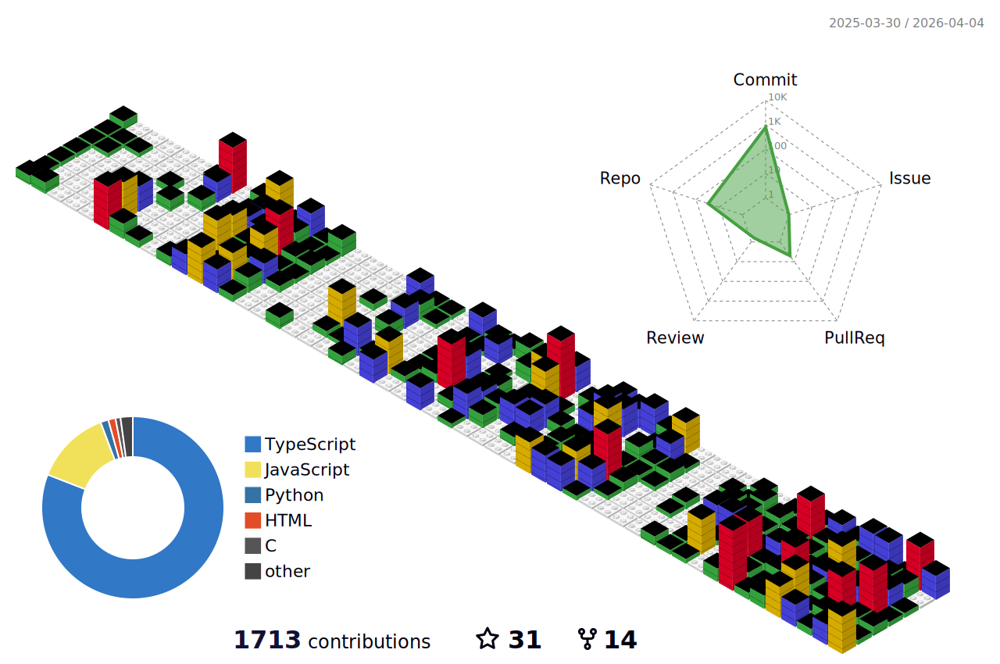

<h1 align="center">
  
</h1>

<div align="center">
  <a href="https://github.com/Lviffy" title="GitHub"></a>
</div>

## About Me
<!--  -->

```javascript
const Rohan = {
    Passion: ["Web3", "Freelance". "big time crypto"],
    Lockedin: [true],
    Cooking: [hard]
};
```
<p align="left">
  Building cool stuff on internet.
</p>

## Technologies & Tools
<div align="center">
  
</div>

## GitHub Statistics



<div align="center">
  <picture>
    <source media="(prefers-color-scheme: dark)" srcset="https://raw.githubusercontent.com/Lviffy/Lviffy/output/github-snake-dark.svg" />
    <source media="(prefers-color-scheme: light)" srcset="https://raw.githubusercontent.com/Lviffy/Lviffy/output/github-snake.svg" />
    
  </picture>
</div>

## My Coding Stats

<!--START_SECTION:waka-->


**🐱 My GitHub Data** 

> 📦 386.7 kB Used in GitHub's Storage 
 > 
> 🏆 1,372 Contributions in the Year 2025
 > 
> 🚫 Not Opted to Hire
 > 
> 📜 36 Public Repositories 
 > 
> 🔑 27 Private Repositories 
 > 
**I'm a Night 🦉** 

```text
🌞 Morning                469 commits         ██████░░░░░░░░░░░░░░░░░░░   25.53 % 
🌆 Daytime                444 commits         ██████░░░░░░░░░░░░░░░░░░░   24.17 % 
🌃 Evening                586 commits         ████████░░░░░░░░░░░░░░░░░   31.90 % 
🌙 Night                  338 commits         █████░░░░░░░░░░░░░░░░░░░░   18.40 % 
```
📅 **I'm Most Productive on Thursday** 

```text
Monday                   275 commits         ████░░░░░░░░░░░░░░░░░░░░░   14.97 % 
Tuesday                  189 commits         ███░░░░░░░░░░░░░░░░░░░░░░   10.29 % 
Wednesday                181 commits         ██░░░░░░░░░░░░░░░░░░░░░░░   09.85 % 
Thursday                 335 commits         █████░░░░░░░░░░░░░░░░░░░░   18.24 % 
Friday                   222 commits         ███░░░░░░░░░░░░░░░░░░░░░░   12.08 % 
Saturday                 331 commits         █████░░░░░░░░░░░░░░░░░░░░   18.02 % 
Sunday                   304 commits         ████░░░░░░░░░░░░░░░░░░░░░   16.55 % 
```


📊 **This Week I Spent My Time On** 

```text
🕑︎ Time Zone: Asia/Kolkata

💬 Programming Languages: 
Markdown                 1 hr 45 mins        █████████████░░░░░░░░░░░░   50.84 % 
TypeScript               1 hr 38 mins        ████████████░░░░░░░░░░░░░   47.57 % 
C                        2 mins              ░░░░░░░░░░░░░░░░░░░░░░░░░   01.23 % 
Git Config               0 secs              ░░░░░░░░░░░░░░░░░░░░░░░░░   00.23 % 
Bash                     0 secs              ░░░░░░░░░░░░░░░░░░░░░░░░░   00.10 % 

🔥 Editors: 
Antigravity              3 hrs 2 mins        ██████████████████████░░░   88.04 % 
VS Code                  24 mins             ███░░░░░░░░░░░░░░░░░░░░░░   11.96 % 

🐱‍💻 Projects: 
Finals                   1 hr 32 mins        ███████████░░░░░░░░░░░░░░   44.76 % 
supabase                 1 hr 25 mins        ██████████░░░░░░░░░░░░░░░   41.25 % 
Portfolio02              25 mins             ███░░░░░░░░░░░░░░░░░░░░░░   12.53 % 
CCC Final Projects       2 mins              ░░░░░░░░░░░░░░░░░░░░░░░░░   01.21 % 
coolclock                0 secs              ░░░░░░░░░░░░░░░░░░░░░░░░░   00.23 % 

💻 Operating System: 
Linux                    3 hrs 27 mins       █████████████████████████   100.00 % 
```

**I Mostly Code in TypeScript** 

```text
TypeScript               29 repos            ████████████░░░░░░░░░░░░░   46.77 % 
JavaScript               15 repos            ██████░░░░░░░░░░░░░░░░░░░   24.19 % 
HTML                     5 repos             ██░░░░░░░░░░░░░░░░░░░░░░░   08.06 % 
Python                   4 repos             ██░░░░░░░░░░░░░░░░░░░░░░░   06.45 % 
C                        2 repos             █░░░░░░░░░░░░░░░░░░░░░░░░   03.23 % 
```


**Timeline**


 Last Updated on 18/12/2025 19:12:30 UTC
<!--END_SECTION:waka-->


## GitHub Trophies
<div align="center">
  
</div>


